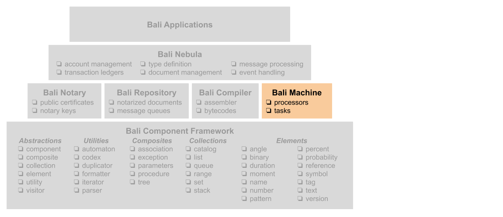

### Bali Nebula™ Virtual Machine
This project provides a JavaScript version of the the Bali Nebula™ Virtual Machine.



_**WARNING**_
_This project is still in its early stages and the classes and interfaces to the classes are likely to change._

### Quick Links
For more information on this project click on the following links:
 * [wiki](https://github.com/craterdog-bali/js-bali-virtual-machine/wiki)
 * [node package](https://www.npmjs.com/package/bali-virtual-machine)
 * [release notes](https://github.com/craterdog-bali/js-bali-virtual-machine/wiki/release-notes)
 * [project documentation](https://github.com/craterdog-bali/bali-project-documentation/wiki)

### Getting Started
To install this NodeJS package, execute the following command:
```
npm install bali-virtual-machine
```
Then add the following line to your NodeJS modules:
```
const vm = require('bali-virtual-machine');
```

Check out the example code [here](https://github.com/craterdog-bali/js-bali-virtual-machine/wiki/code-examples).

